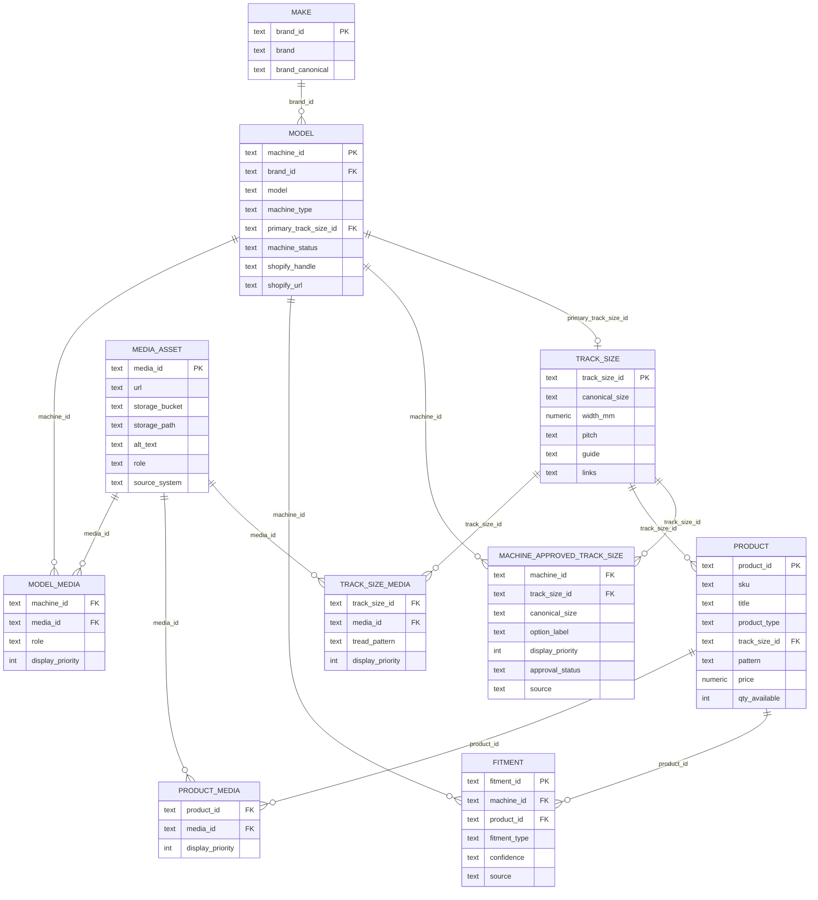

# My Fleet — Entity Relationship

Dev branch schema: `core.*`  
Public API layer: `public.fleet_*`

---

## ER diagram (conceptual)



---

## Primary keys

| Entity | PK | Example |
|--------|-----|---------|
| Brand | `brand_id` | `make_john_deere` |
| Model | `machine_id` | `mdl_john_deere_323e` |
| Track size | `track_size_id` | `ts_320x86x52` |
| Product | `product_id` | `prod_tnt3208652hdbl` |
| Fitment | `fitment_id` | UUID / generated |
| Media | `media_id` | `media_ts_320x86bx52_hero_01` |

---

## Relationship rules

### Machine → track sizes (many-to-many, approved)

- Source: `core.machine_approved_track_size`
- One machine may have 1–N approved sizes (wide/narrow common on CTL)
- `primary_track_size_id` on model is the default/recommended narrow or standard size
- UI reads **`fleet_machine_track_size_options`** only — never infers sizes from supplier fitment rows

### Track size → products (one-to-many)

- `core.product.track_size_id` FK → `core.track_size`
- v2 gate: product must join `core.v_track_size_v2` to appear in `fleet_products`
- Same canonical size may map to multiple `track_size_id` variants (`320x86x52` vs `320x86Bx52`) — products link to the spec-backed ID from TrackTech export

### Track size → images (one-to-many)

- `core.track_size_media` links gallery rows to `track_size_id`
- Optional `tread_pattern` for tread-specific hero/detail shots
- Shared: all machines and products on that size inherit unless SKU has override

### Product → images (one-to-many)

- `core.product_media` for SKU-specific shots (common on sprockets/idlers/rollers)
- Rubber tracks usually inherit track-size gallery; SKU media optional

### Model → images (one-to-many, typically one hero)

- `core.model_media` role=`hero` for machine page header
- Matched via `shopify_handle` from track-finder or brand+model from hero manifest

### Fitment (machine + product)

- Bridge table for parts counter and Q&A
- Does not define approved track sizes (that's `machine_approved_track_size`)
- Supplier fitment can attach UC parts without track size match

---

## View dependency graph

```
core.v_track_size_v2
  ├── core.v_track_size_spine_v2 → fleet_track_size_spine
  ├── fleet_products (inner join)
  └── fleet_qa_parts (track products require v2 pts)

core.machine_approved_track_size → fleet_machine_track_size_options

core.model (active_v1) → fleet_machine_catalog

core.media_asset
  ├── track_size_media → fleet_track_size_media
  ├── product_media → fleet_product_media
  └── model_media → fleet_model_hero

computed → fleet_enrichment_tasks
```

---

## External data (not in core, used for audit/import only)

| Source | Maps to |
|--------|---------|
| `data/imports/track-finder-data.json` | Navigation, approved sizes, Shopify URLs |
| `data/hi-track-images-master.csv` | `track_size_media` |
| `data/model-hero-images-manifest.json` | `model_media` |
| TrackTech XLSX export | `core.product` specs + `track_size_id` repoint |
| Production `public.catalog_images` | Audit source for track galleries |

Production media URLs may reference `tcykyktvdlsbscrsbjyt` storage buckets until dev buckets are synced; URLs remain valid public objects.
